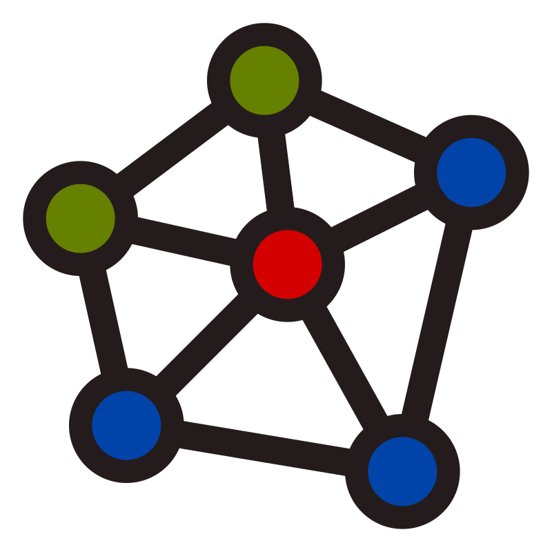

<div align="center">
  <picture>
    
  </picture>
<br>

<h2>IssunDB</h2>

[](https://github.com/IssunDB/issun-db/actions/workflows/tests.yml)
[](https://codecov.io/gh/IssunDB/issun-db)
[](https://crates.io/crates/issundb)
[](https://docs.rs/issundb)
[](https://issundb.github.io/issun-db/)
[](https://github.com/IssunDB/issun-db)

An embedded graph database for AI applications and graph analytics

</div>

---

IssunDB is an embedded graph database written in Rust.
It can be embedded in Rust applications without a separate server, and is designed for applications such as GraphRAG pipelines and knowledge graphs.

**You can download the latest binaries (for IssunDB CLI, MCP and HTTP servers) from [here](https://github.com/IssunDB/issun-db/releases).**

### Key Features

* ACID transactions, property graph model, and Cypher query support
* Graph traversal and analytics using sparse matrix operations
* Vectorized query execution with multi-core parallel processing
* Vector, full-text, and hybrid search
* APIs for Rust, Python, CLI, HTTP REST, and MCP
* Support for Linux, macOS, and Windows

> [!IMPORTANT]
> This project is still in early development, so bugs and breaking changes are expected.
> Please use the [issue page](https://github.com/IssunDB/issun-db/issues) to report bugs or request features.

---

### Quickstart

To use IssunDB in your Rust project, add the dependency to your `Cargo.toml`:

```toml
[dependencies]
issundb = "0.1.0-alpha.14"
serde_json = "1.0"
```

> [!NOTE]
> IssunDB needs Rust 1.85.0 or newer.

The following example opens a database, inserts nodes, creates relationships, and queries the graph using Cypher:

```rust
use std::path::Path;
use issundb::{Graph, GraphQueryExt};

fn main() -> Result<(), Box<dyn std::error::Error>> {
    // Open a graph database (with a 1 GB memory map size limit)
    let graph = Graph::open(Path::new("./issundb-data"), 1)?;

    // Add two nodes with properties
    let alice_props = serde_json::json!({ "name": "Alice", "age": 30 });
    let alice_id = graph.add_node("Person", &alice_props)?;

    let bob_props = serde_json::json!({ "name": "Bob", "age": 28 });
    let bob_id = graph.add_node("Person", &bob_props)?;

    // Add an edge between the nodes
    let edge_props = serde_json::json!({ "since": 2021 });
    graph.add_edge(alice_id, bob_id, "KNOWS", &edge_props)?;

    // Optional: rebuild CSR snapshot manually after bulk writes
    graph.rebuild_csr()?;

    // Run a Cypher query and print the results
    let result = graph.query(
        "MATCH (a:Person)-[r:KNOWS]->(b:Person) RETURN a.name, b.name, r.since"
    )?;

    for record in result.records {
        println!(
            "Match: {} knows {} since {}",
            record.values[0],
            record.values[1],
            record.values[2]
        );
    }

    Ok(())
}
```

```
# Output:
Match: "Alice" knows "Bob" since 2021
```

---

### Running IssunDB in a Container

#### CLI

```bash
# Run IssunDB with the CLI
docker run --rm -it -v issundb-data:/data ghcr.io/issundb/issundb:latest
```

#### HTTP (REST)

```bash
# Run IssunDB with the HTTP API on port 7474
docker run --rm -p 7474:7474 -v issundb-data:/data ghcr.io/issundb/issundb:latest issundb-rest
```

#### MCP

```bash
# Run IssunDB with the MCP API on port 8000
docker run --rm -p 8000:8000 -v issundb-data:/data ghcr.io/issundb/issundb:latest issundb-mcp
```

---

### Documentation

The project documentation is available [here](https://issundb.github.io/issun-db/).
The Rust API documentation is available on [docs.rs/issundb](https://docs.rs/issundb).

#### Rust Examples

Refer to the [issundb-examples](crates/issundb-examples) crate for Rust API examples.

#### Python Examples

Refer to the [issundb-py/examples](crates/issundb-py/examples) directory for Python API examples.

#### Knowlege Graph Demo

[](https://asciinema.org/a/L1iTAtQeVeCe6jiX)


---

### Contributing

See [CONTRIBUTING.md](CONTRIBUTING.md) for details on how to make a contribution.

### License

IssunDB is available under either of these licenses:

* MIT License ([LICENSE-MIT](LICENSE-MIT))
* Apache License, Version 2.0 ([LICENSE-APACHE](LICENSE-APACHE))

### Acknowledgements

* The logo is from [SVG Repo](https://www.svgrepo.com/svg/451006/knowledge-graph) with some modifications.
