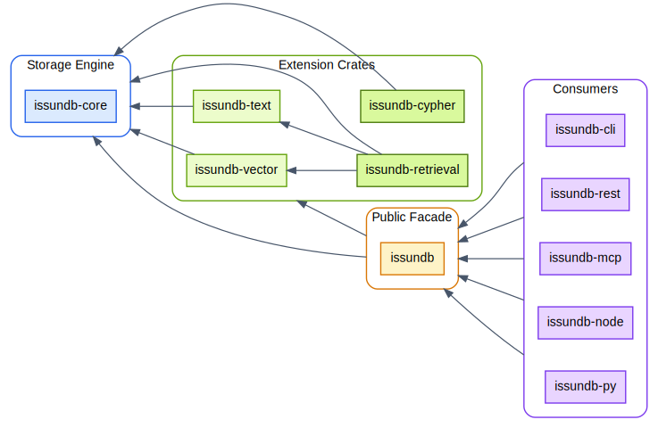

# IssunDB

IssunDB is a fast embedded graph database, written in Rust.
It can be embedded in Rust applications without the need for a server, and can be used for a wide range of applications such as building
GraphRAG pipelines and querying knowledge graphs.

## Key Features

* Rust graph engine built with ACID, property graph model, and Cypher query language support
* Fast graph traversal and analytics using sparse matrix operations
* Fast vectorized query execution with multi-core query parallelism and serializable transactions
* Built-in vector, text, and hybrid search and retrieval
* Provides a wide range of APIs, including native Rust, Python bindings, CLI, HTTP (REST), and MCP
* Fully cross-platform; supports Linux, macOS, and Windows

## Architecture Overview

The database is built as a set of modular crates:

| Crate               | Purpose                                                                     |
|---------------------|-----------------------------------------------------------------------------|
| `issundb-core`      | Storage engine, schema types, configurations, and property columns.         |
| `issundb-vector`    | Vector embedding storage, search indexing, and quantization configurations. |
| `issundb-text`      | Tokenizer implementation, inverted indexes, and BM25 text search scoring.   |
| `issundb-retrieval` | Multi-source hybrid retrieval, rank fusion, and graph traversal.            |
| `issundb-cypher`    | Cypher query parser, AST definitions, planners, and executors.              |
| `issundb`           | Public facade (the API) of IssunDB that provides a unified API for use.     |
| `issundb-cli`       | An interactive CLI for IssunDB.                                             |
| `issundb-rest`      | An HTTP server that exposes IssunDB's functionalities over REST API.        |
| `issundb-mcp`       | MCP server implementation for IssunDB.                                      |
| `issundb-py`        | Python bindings for IssunDB.                                                |

  

## Documentation Sections

- [Getting Started](getting-started.md): Installation, build instructions, basic CLI usage, and usage in Rust projects.
- [Code Examples](examples.md): Practical code examples for vector search, text search, and Cypher query execution.
- [API Reference](api-reference.md): Public Rust API reference, types, and Cypher DDL syntax.
- [Hybrid Retrieval](hybrid-retrieval.md): Concept overview and implementation guide for GraphRAG pipelines.
- [Integrations](integrations.md): Exposing IssunDB over HTTP REST and the MCP.
