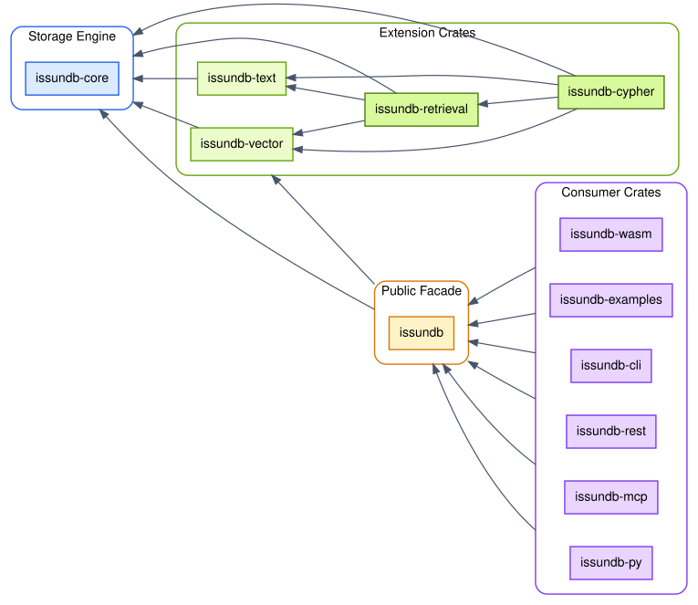

# IssunDB

IssunDB is an embedded graph database, written in Rust.

## Key Features

* ACID transactions, property graph model, and Cypher query support
* Graph traversal and analytics using sparse matrix operations
* Vectorized query execution with multi-core parallel processing
* Vector, full-text, and hybrid search
* APIs for Rust, Python, CLI, HTTP REST, and MCP
* Support for Linux, macOS, and Windows

## Architecture Overview

The database is designed as a set of modular crates, establishing clear boundaries between storage, queries, and indexes:

| Crate               | Purpose                                                                     |
|---------------------|-----------------------------------------------------------------------------|
| `issundb-core`      | Storage engine, schema types, configurations, and property columns.         |
| `issundb-vector`    | Vector embedding storage, search indexing, and quantization configurations. |
| `issundb-text`      | Tokenizer implementation, inverted indexes, and BM25 text search scoring.   |
| `issundb-retrieval` | Multi-source hybrid retrieval, rank fusion, and graph traversal.            |
| `issundb-cypher`    | Cypher query parser, AST definitions, planners, and executors.              |
| `issundb`           | The primary library crate providing a unified public API.                   |
| `issundb-cli`       | An interactive CLI for IssunDB.                                             |
| `issundb-rest`      | An HTTP server that exposes IssunDB's functionalities over REST API.        |
| `issundb-mcp`       | MCP server implementation for IssunDB.                                      |
| `issundb-py`        | Python bindings for IssunDB.                                                |

  

## Documentation Sections

- [Getting Started](getting-started.md): Installation, build instructions, basic CLI usage, and usage in Rust projects.
- [Code Examples](examples.md): Practical code examples for vector search, text search, and Cypher query execution.
- [Cypher Support](cypher.md): The supported Cypher clauses, patterns, expressions, and functions, plus known deviations.
- [API Reference](api-reference.md): Public Rust API reference, types, and Cypher DDL syntax.
- [Hybrid Retrieval](hybrid-retrieval.md): Concept overview and implementation guide for GraphRAG pipelines.
- [Integrations](integrations.md): Exposing IssunDB over HTTP (REST) and MCP.
- [Python Integration](python.md): Working with IssunDB directly from Python.
